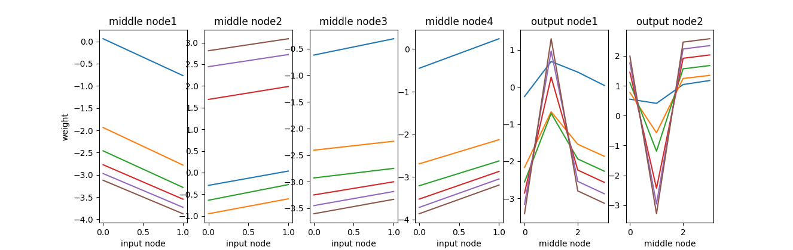
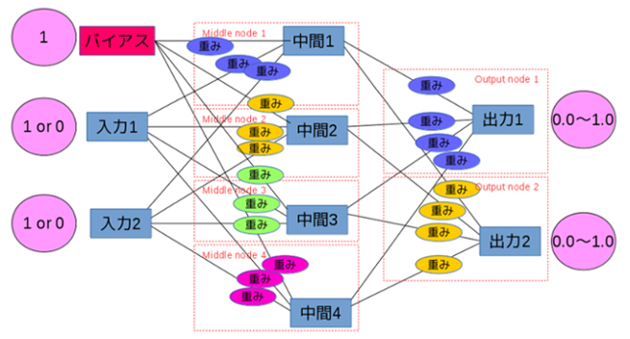

## ディープラーニングを学ぼう
* 参考書籍：ニューラルネットワーク自作入門  
* AND条件を学習させ、その学習過程を調べる  
* パラメータを変化させて、結果を見える化する  

## 前提
* python3系Anaconda
* グラフ化はmatplotlibを使う  
* マルチプロセスで動作するようにmultiprocessingを使う
* フレームワーク無し。参考書籍より自作する
* 3層（入力：2、中間：4、出力：2）
* AND条件を学習させる。以下の表はAND条件を示す  

|入力1|入力2||出力|
|:---|:---|:---|:---|
|○：true|○：true||○：true|
|○：true|×：false||×：false|
|×：false|○：true||×：false|
|×：false|×：false||×：false|

## 3層ノードのイメージ
* 入力層にはAND条件を入れる。例えば「true, true」を入力したいならば、「入力1=1, 入力2=1」とする。  
* 初期値をランダムに設定された重みを加えて、中間層に渡す。  
* 中間層から、出力層へも初期値をランダムに設定された重みを加えて渡す。  
* 出力層でどちらか値が大きいノード（出力1=trueとする or 出力2=falseとする）を結果とする。  
  

## 重みの変化をグラフ化してみた
* 青い線が初期の重み。初期値はランダム値  
* 徐々に学習を行い、重みが変化していく様子がわかる  
* 学習による重みの変化は、初めは大きく、徐々に小さくなっている  
* また右上のグラフだけ、線の色の順番が異なっている  
たぶん途中で学習する方向（重みの変化の方向）が変わっている  
[ソースコード：and.py](epoch/and.py)  
  

## XOR条件での失敗
 * AND条件と同じプログラムでXOR条件を試したが、成功率がどうしても50%になってしまう。  
 * AND条件では学習率や各層ごとのノード数を変えることで、学習していたが、
 XOR条件ではいろいろパラメータを変えても、学習ができなかった。  
 基本的には3層（入力：2、中間：4、出力：2）で試したがダメ。  
 * 線形（AND、OR）は学習できたが、非線形（XOR）はできず。  

## バイアスの追加で、XOR学習が成功した
 * 3層（入力：3、中間：4、出力：2）とすることでXOR学習が成功した。  
 入力を2ではなく3とした。増やしたのはバイアスで入力値を1に固定したもの。  

 |入力1|入力2|バイアス||出力|
 |:---|:---|:---|:---|:---|
 |○：true|○：true|1||×：false|
 |○：true|×：false|1||○：true|
 |×：false|○：true|1||○：true|
 |×：false|×：false|1||×：false|

## XOR学習の注意点
 * バイアスという概念を追加することで、非線形（XOR）の学習に成功。  
 入力条件によらず、値は常に1として、バックプロパゲーションで重み更新のみ行う。  
 * AND条件に較べて、XOR条件の学習は遅く、数倍以上のエポックが必要となる。  
 * 中間層を4つとしているが、3つではうまく学習ができなかった。  
 * 本当はバイアスを入力層だけではなく、中間層にも付けたかったが、修正による影響が見えないため見送り。  
[ソースコード：xor.py](xor/xor.py)  
  
